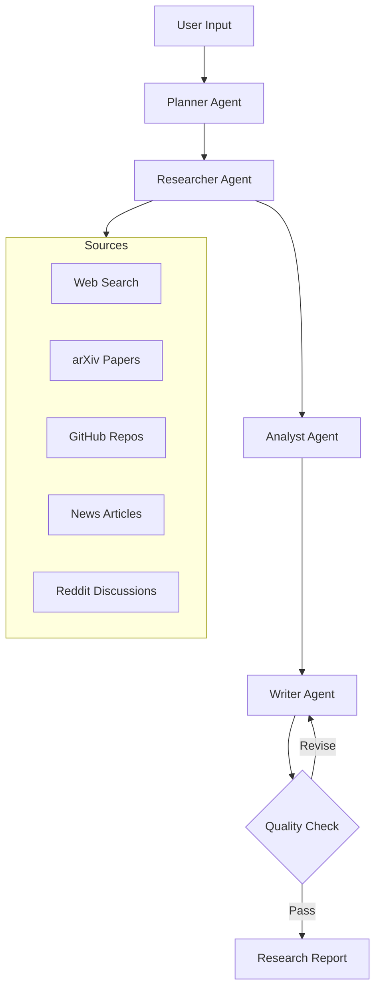

# 🔬 DeepResearch Agent

> Autonomous multi-source research agent powered by MiMo

[](https://opensource.org/licenses/MIT)
[](https://www.python.org/downloads/)
[](https://mimo.xiaomi.com)

## 🚀 What is DeepResearch Agent?

DeepResearch Agent is a **fully autonomous research system** that plans, searches, analyzes, and generates comprehensive cited reports. Unlike traditional search tools that just answer questions, DeepResearch **thinks for itself** and conducts deep research across multiple sources.

### ✨ Key Features

- 🧠 **Autonomous Planning** - Agent decides its own research strategy
- 🔍 **Multi-Source Research** - Web, ArXiv, Reddit, GitHub, News
- 📊 **Cross-Reference Analysis** - Finds patterns and contradictions
- 📝 **Citation System** - Every claim has a source
- 🔄 **Self-Correcting** - Improves research if initial approach fails
- 💾 **Knowledge Memory** - Builds knowledge base over time
- 🤖 **Multi-Agent Architecture** - Specialized agents collaborate
- 📱 **Telegram Bot** - Research from anywhere
- 🌐 **REST API** - Integrate with your apps

## 🏗️ Architecture



**How it works:**

1. **Planner** breaks down your topic into targeted sub-queries
2. **Researcher** executes parallel searches across multiple sources
3. **Analyst** cross-references findings and calculates confidence
4. **Writer** generates a structured report with citations
5. **Critic** reviews quality — if issues found, report gets revised

## 🛠️ Installation

### Quick Start

```bash
# Clone the repository
git clone https://github.com/vaniaodyy/deepresearch-agent.git
cd deepresearch-agent

# Install dependencies
pip install -e .

# Run research
deepresearch research "AI trends in 2025"
```

### Docker

```bash
# Clone and build
git clone https://github.com/vaniaodyy/deepresearch-agent.git
cd deepresearch-agent

# Set environment variables
export TELEGRAM_BOT_TOKEN="your-token"
export LLM_API_KEY="your-mimo-key"

# Run with Docker Compose
docker-compose up -d

# Or run API only
docker-compose up api
```

## 📖 Usage

### CLI

```bash
# Basic research
deepresearch research "quantum computing applications"

# Save report to file
deepresearch research "AI in healthcare" -o report.md

# View history
deepresearch history

# Start API server
deepresearch serve --port 8000
```

### API

```bash
# Start the server
deepresearch serve

# Make a research request
curl -X POST http://localhost:8000/research \
  -H "Content-Type: application/json" \
  -d '{"topic": "AI in Indonesia", "depth": "deep"}'

# Check health
curl http://localhost:8000/health

# View history
curl http://localhost:8000/history
```

### Telegram Bot

1. Get a bot token from [@BotFather](https://t.me/BotFather)
2. Set environment variable: `export TELEGRAM_BOT_TOKEN="your-token"`
3. Run the bot: `deepresearch-telegram`
4. Send any topic to your bot!

## ⚙️ Configuration

### Environment Variables

```bash
# Required
TELEGRAM_BOT_TOKEN=your-telegram-bot-token
LLM_API_KEY=your-mimo-api-key

# Optional
LLM_ENDPOINT=https://api.mimo.xiaomi.com/v1/chat/completions
LLM_MODEL=mimo-7b
DB_PATH=data/research.db
```

### Config File

Create `config.yaml`:

```yaml
llm:
  endpoint: https://api.mimo.xiaomi.com/v1/chat/completions
  model: mimo-7b
  api_key: your-key

research:
  max_sources_per_query: 5
  parallel_searches: 3
  research_depth: medium

telegram:
  bot_token: your-token
```

## 🎯 Use Cases

| Use Case | Example |
|----------|---------|
| 🎓 Academic Research | Literature reviews, thesis research |
| 💼 Business Intelligence | Market research, competitor analysis |
| 📰 Journalism | Investigative research, fact-checking |
| 🧑‍💻 Technology Research | Library comparison, trend analysis |
| 🏢 Enterprise | Industry reports, regulatory research |
| 👤 Personal | Any topic you want to understand deeply |

## 📊 Example Output

```markdown
# Research Report: AI in Indonesia 2025

**Confidence:** 87% | **Sources:** 15

## Executive Summary

Indonesia's AI market is projected to reach $1.2 billion by 2025,
growing at 35% CAGR. Key drivers include government digital
transformation initiatives and a young, tech-savvy population...

## Key Findings

1. Government allocated $500M for AI research (Source: Ministry of Communication)
2. 500+ AI startups operating in Indonesia (Source: IDC Report)
3. Healthcare AI adoption grew 45% YoY (Source: McKinsey)

## Citations

1. [Ministry of Communication Report](https://example.com/1)
2. [IDC Indonesia AI Market](https://example.com/2)
3. [McKinsey Digital Indonesia](https://example.com/3)
```

## 🤝 Contributing

Contributions are welcome! Please see [CONTRIBUTING.md](CONTRIBUTING.md) for guidelines.

## 📄 License

This project is licensed under the MIT License - see the [LICENSE](LICENSE) file for details.

## 🙏 Acknowledgments

- [MiMo](https://mimo.xiaomi.com) - Primary LLM powering the research
- [DuckDuckGo](https://duckduckgo.com) - Web search
- [arXiv](https://arxiv.org) - Academic papers
- [FastAPI](https://fastapi.tiangolo.com) - API framework
- [Python Telegram Bot](https://python-telegram-bot.org) - Telegram integration

## 📧 Contact

- GitHub: [@vaniaodyy](https://github.com/vaniaodyy)
- Email: vanianaody@gmail.com

---

*DeepResearch Agent — Autonomous research powered by MiMo*
